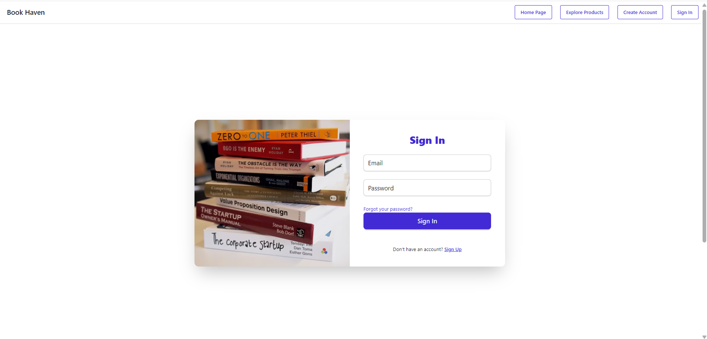
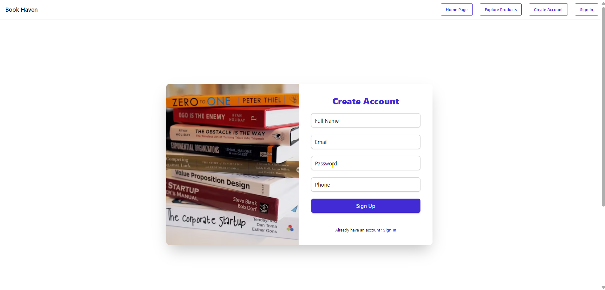
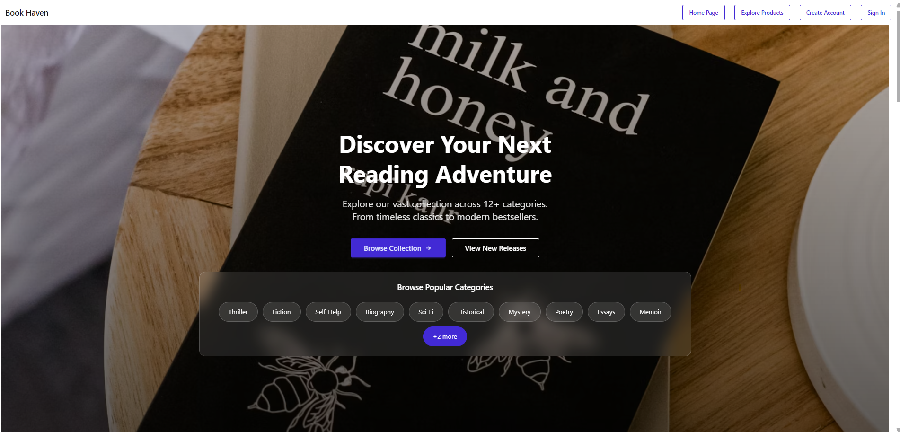
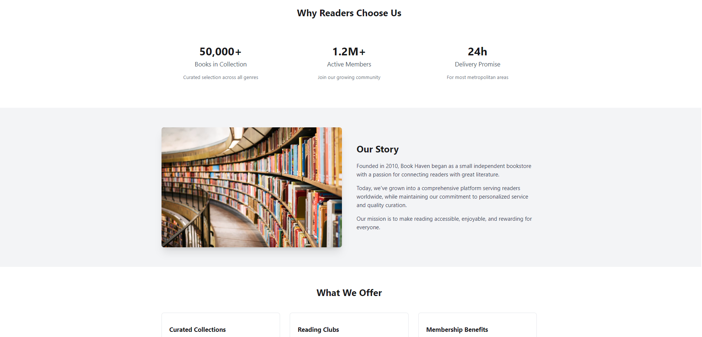
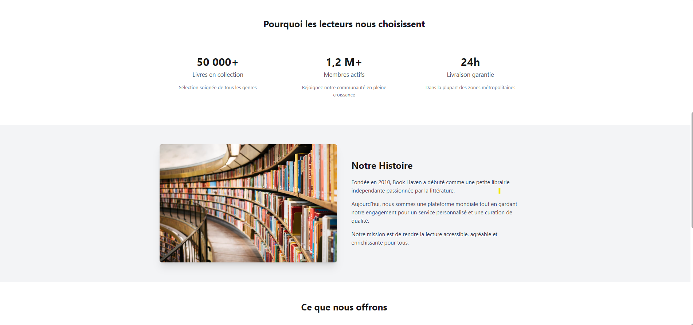
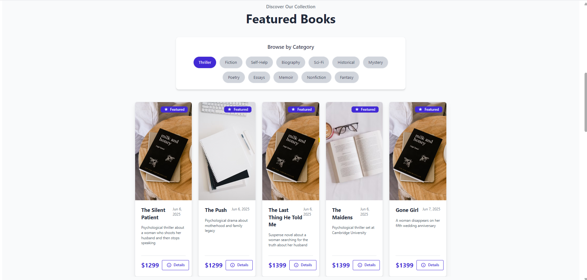
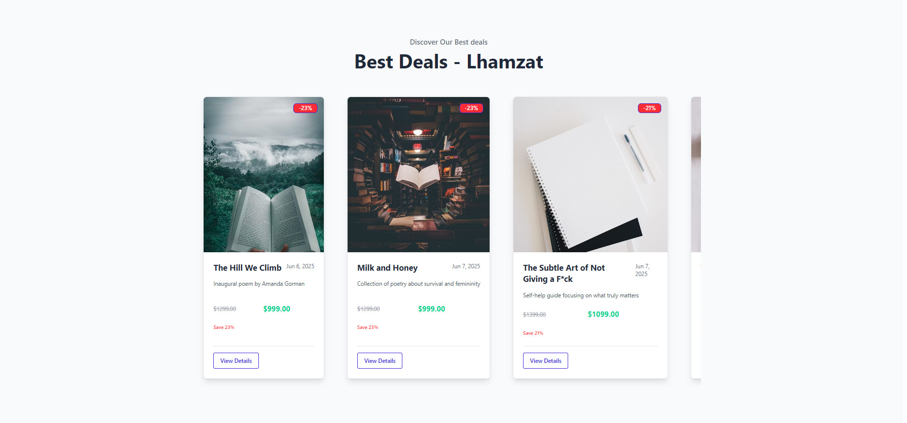
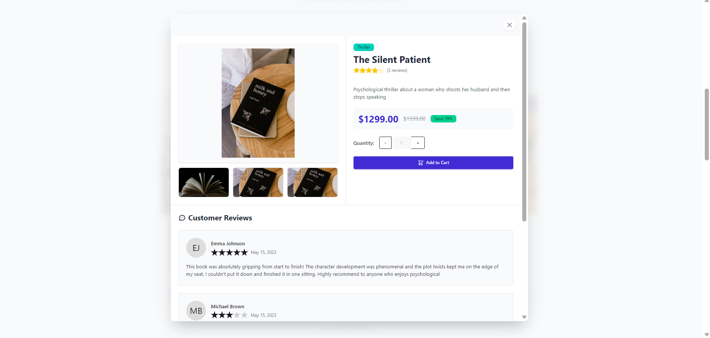
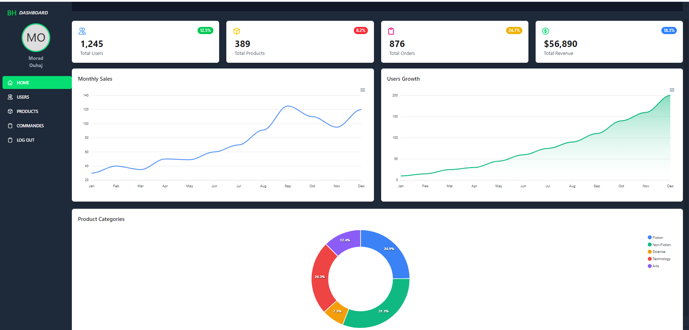
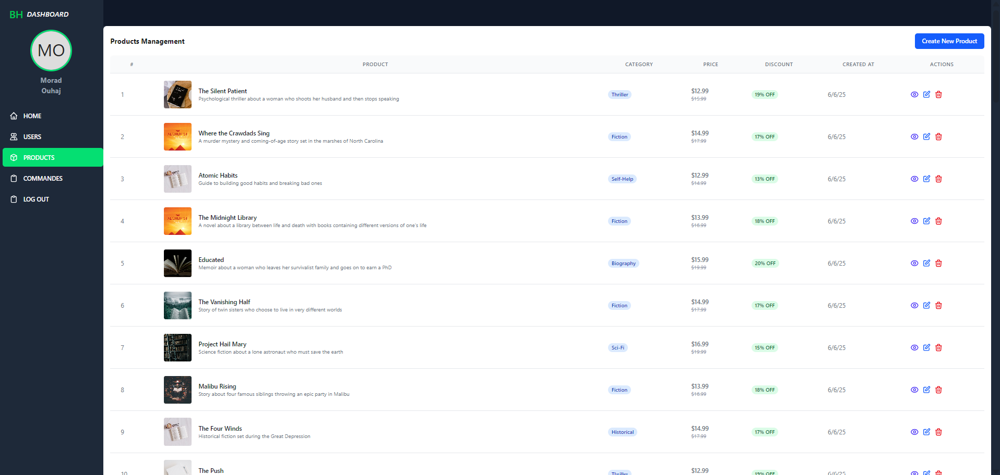

# 📚 BOOK Haven – Application E-Commerce Angular + Node.js

BOOK Haven est une application e-commerce multilingue (français canadien et anglais américain) développée avec Angular pour le frontend et Node.js pour le backend.  
Elle permet aux utilisateurs de découvrir, consulter et acheter des livres, avec également une interface d'administration simple.

---

## 🔧 Backend – Serveur Node.js

Le backend de l'application est basé sur le dépôt suivant :  
👉 [`sangnguyen190997/shopping-ecommerce`](https://github.com/sangnguyen190997/shopping-ecommerce/tree/master/backend)

### ✅ Étapes essentielles :

```bash
# 1. Cloner le dépôt
git clone https://github.com/sangnguyen190997/shopping-ecommerce.git
cd shopping-ecommerce/backend

# 2. Installer les dépendances
npm install

# 3. Lancer le serveur
node index.js
```

ℹ️ Les autres étapes détaillées de configuration sont disponibles dans le README original du backend et dans le rapport fourni avec ce projet.

## 🔧 FrontEnd – Angular
```bash

# 1. Cloner le dépôt GitHub :

git clone https://github.com/moradoulhaj/TP-Angular-MoradOulhaj
cd TP-Angular-MoradOulhaj

# 2. Installer les dépendances Node.js :
npm install

# 3. Construire l’application en mode production avec localisation :
Cette commande génère les fichiers optimisés pour les deux langues configurées (fr-CA et en-US) :
ng build --configuration production --localize

# 4. Lancer le serveur de production :
Le frontend compilé se trouve dans le dossier dist/.
Un serveur Node.js (server.js) est utilisé pour le servir :
node server.js

# 5. Accéder à l’application :
Ouvrir votre navigateur à l’une des adresses localisées :

🇨🇦 Version française : http://localhost:8085/fr-CA

🇺🇸 Version anglaise : http://localhost:8085/en-US

```


## 🖼️ Screenshots

### 🔐 Page de Connexion (Login)  


### 📝 Page d'inscription (SignUp)  


### 🏠 Page d’Accueil Utilisateur  


### 🌍 Section À propos (English)  


### 🇫🇷 Section À propos (Français)  


### 🔍 Section Découvrir  


### ⭐ Section Meilleures Offres  


### 🔎 Détail Produit (Modal)  


### 🛒 Panier d’Achat  


### ⚙️ Interface Admin – Tableau de Bord  


### 📦 Admin – Gestion des Produits  



