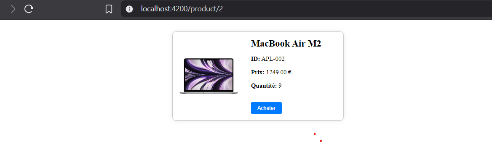
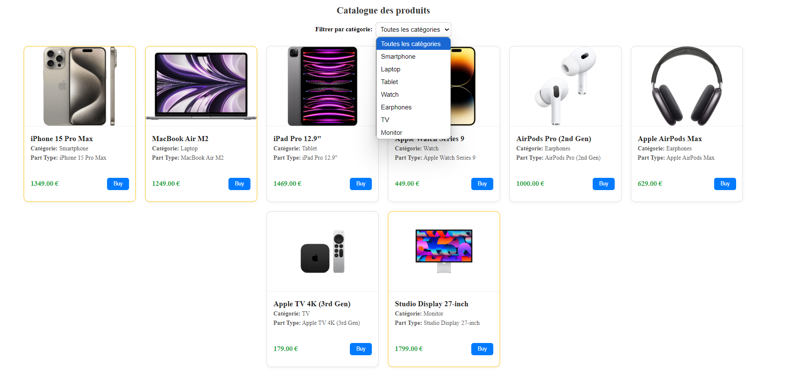
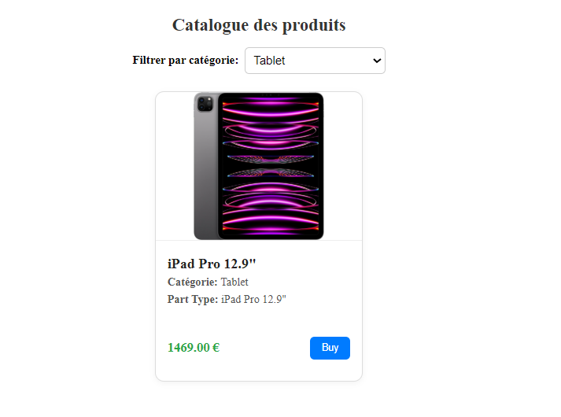
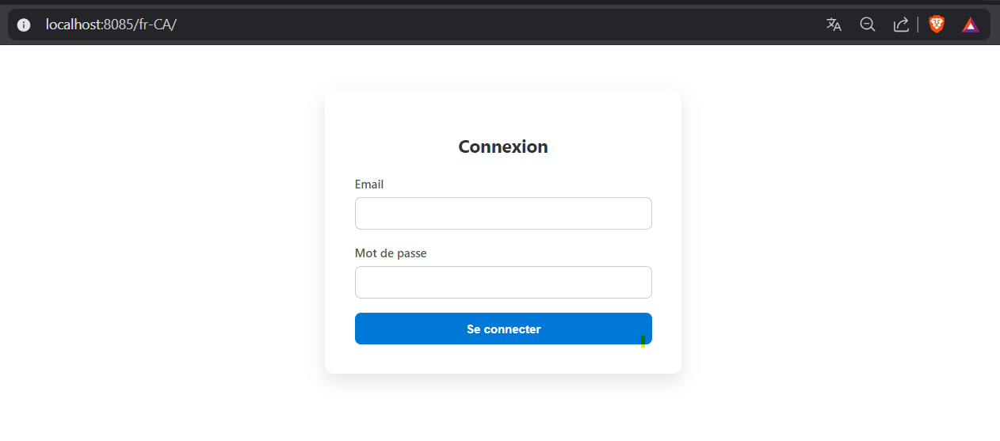
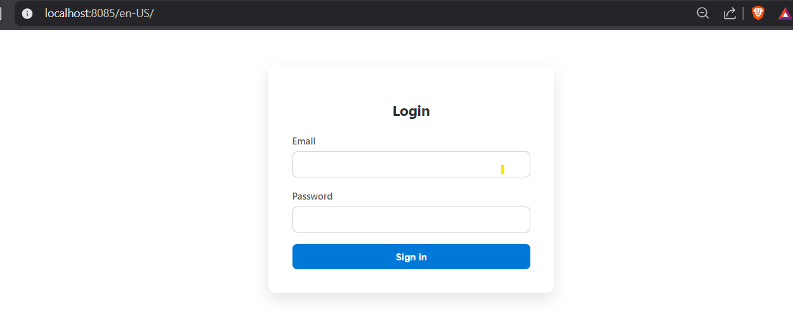

# Product Catalog Application

Developed by **MORAD OULHAJ**

This is a simple product catalog application built using **Angular** for the frontend.
## Table of Contents
- [Dependencies](#dependencies)
- [Setup & Running](#setup--running)
  - [1. Clone the Repository](#1-clone-the-repository)
  - [2. Install Frontend Dependencies](#2-install-frontend-dependencies)
  - [3. Serve the Application](#3-serve-the-application)
  - [4. Build the Application (Optional)](#4-build-the-application-optional)
- [Screenshots](#screenshots)

## Screenshots

### Catalog View


### Product Details

### Catalog View v2


### Filter based on products category


### Login Page (French version - fr-CA)


### Login Page (English version - en-US)



## Dependencies

Before you run the application, make sure you have the following dependencies installed:

### Frontend (Angular)

1. **Node.js**: Ensure that Node.js is installed. You can download it from [nodejs.org](https://nodejs.org/).

2. **Angular CLI**: The Angular Command Line Interface (CLI) is needed to manage the project.
   
   Install Angular CLI globally using npm:
   ```bash
   npm install -g @angular/cli
